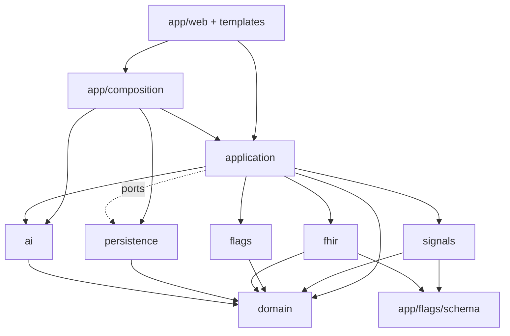
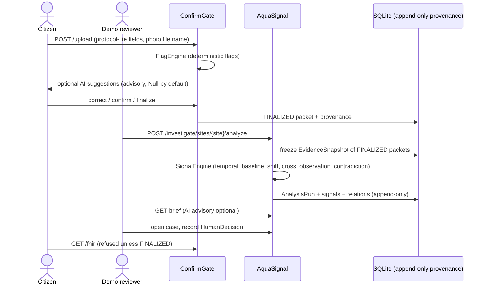

# Architecture

This is a single FastAPI process (a modular monolith) backed by one SQLite file. There are no background workers and no queues. Every action is an explicit HTTP request made by a human.

## Module map

| Package | Responsibility | Must not import |
|---|---|---|
| `app/domain` | `ObservationPacket` state machine, cities and sites, evidence, signals, `InvestigationCase`, `HumanDecision`, and the provenance intents port | FastAPI, Jinja, sqlite3, httpx, `app.fhir`, `app.ai`, `app.web` |
| `app/flags` | Deterministic `FlagEngine`, rules, field schema and vocabularies | persistence, web, FHIR, AI |
| `app/signals` | Pure `SignalEngine`, the two detectors, ordinal maps, stats, vocabulary canonicalization | persistence, web, AI, FHIR, application, sqlite3 |
| `app/application` | Use-case services: citizen flow, reviewer flow, `AnalysisService`, `InvestigationService`, brief, AI advisory wrapper; repository **ports** | sqlite3 or other drivers |
| `app/persistence` | SQLite repositories, `UnitOfWork`, SQL migrations (`migrations/*.sql`), `DATABASE_URL` parsing | web |
| `app/provenance` | Append-only provenance log helpers | web |
| `app/ai` | `AiAssistPort` and `InvestigationCopilotPort`; Null, Fake, and OpenAI-compatible HTTP implementations; prompts; output validation; claim-safety filter | domain writes, persistence, FHIR |
| `app/fhir` | `OahFhirMapper`, `StructuralGuard`, exporter that refuses anything not `FINALIZED` | web |
| `app/web` | Thin FastAPI routers and form parsing; HTML templates live in `app/templates` | sqlite3, `app.persistence`, FHIR mapper |
| `app/demo` | Synthetic fixture loader for AquaSignal (`app/demo/aquasignal/*.json`) | |
| `app/composition.py` | Composition root: builds the service graph once from environment config | |
| `app/main.py` | FastAPI app, static files, routers | |

Architecture tests in `tests/**/test_*architecture*.py` and `tests/persistence/test_migrations_security_arch.py` parse imports with `ast` and enforce these rules.

## Dependency direction

Persistence implements the repository ports defined in `app/application/ports.py`. The application layer never touches SQL directly.

## Runtime flow

## Key invariants

- **Human authority.** Only human actions confirm, finalize, open cases, or record decisions. AI output is always shown as advisory.
- **FHIR only at `FINALIZED`.** The exporter refuses anything else. `Observation.status` is always `final`, never `preliminary`.
- **Deterministic analysis.** Windows come from evidence timestamps (`app/application/analysis_policy.py`). The snapshot hash covers the evidence manifest and the canonicalization version. The parameters hash covers detector parameters. The detector set version is recorded on every run.
- **Canonicalization is detector-only.** `app/signals/vocabulary.py` collapses synonyms such as `none`/`absent` before the detectors run. The original values stay on the packet, in the evidence items, and in the FHIR export.
- **Concurrency.** Each unit of work opens its own SQLite connection (WAL mode, `busy_timeout`). Route handlers are sync `def`, so FastAPI runs them in its threadpool and blocking SQLite or AI calls never block the event loop.
- **Migrations** run automatically when the app starts (`app/persistence/migrations_runner.py`).

## Known structural limits

- There is no authentication. A single demo reviewer identity (`demo-reviewer`) is injected in `app/composition.py`.
- `HumanDecision` records live in their own tables. They are not copied into the ConfirmGate packet provenance.
- The riparian-cover vocabularies (domain bins, descriptive bins, TemporaryOahSystem percent codes) overlap but are deliberately **not** aliased.
- The flag rule that scans citizen notes and suggestion keys for excluded indicators (`app/flags/rules/nonclaim.py`) keeps its own word list. It is separate from the AI claim-safety module (`app/ai/claim_safety.py`).
